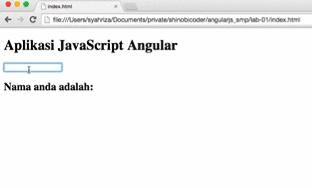

####Lab 01
Ini adalah hands-on pembuatan aplikasi Angular JS yang paling sederhana.

Langkah eksekusi :

1. Buka file index.html
2. Ketikkan nama anda pada kotak isian

####Hasil

Dibawah ini adalah hasil dari eksekusi program

